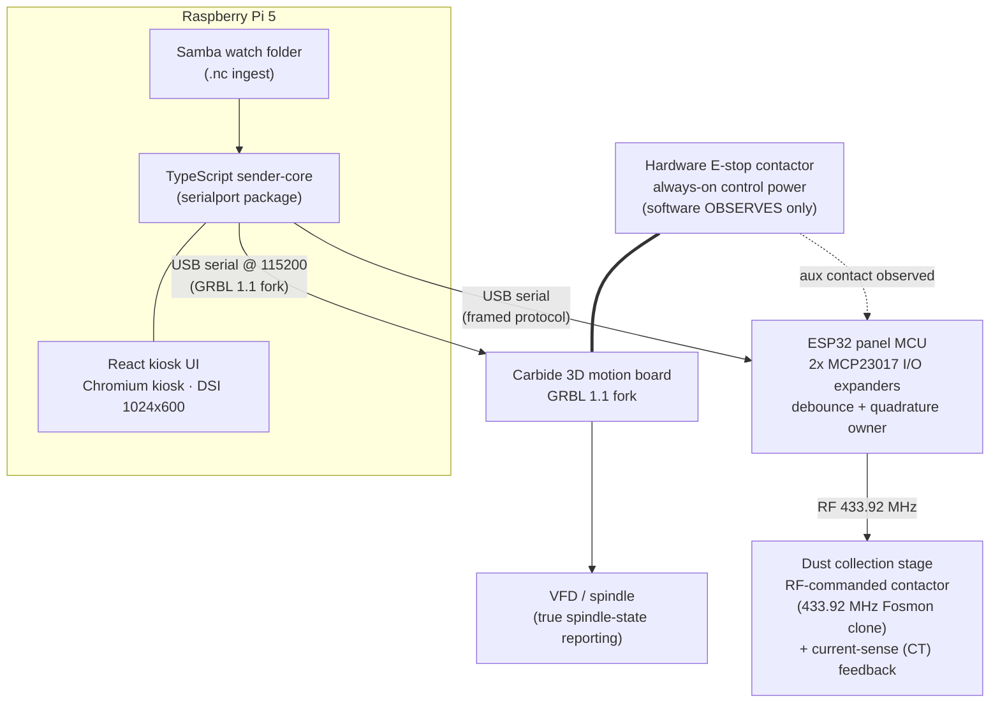

# Shapeoko Controller — Architecture Decision Record

This document records the **locked** architecture decisions for the
`shapeoko-controller` project in ADR style. Its purpose is durable: future
implementation agents (human or automated) must read it before proposing
structural or safety-affecting changes, so that settled decisions are not
relitigated and safety constraints are not quietly weakened.

**How to read this document**

- Every entry below has a **status of `LOCKED`**. A locked decision is not open
  for revision through ordinary implementation work. Changing one requires an
  explicit, owner-approved decision that supersedes this record — not a code
  review comment or a convenience refactor.
- Each entry states the **Decision**, its **Rationale**, and its
  **Consequences**.
- The [Decisions that are NOT open for relitigation](#decisions-that-are-not-open-for-relitigation)
  section restates the hardest constraints as explicit non-conformance rules.
- Anything **not** listed here as locked is still open. Do not treat an
  unlisted implementation detail as settled because it appears in passing.

The project is licensed **MIT** (see [`LICENSE`](../LICENSE)). Licensing
constraints that shape what source may enter this repository are binding and are
summarized in [Licensing constraints](#licensing-constraints); the authoritative
text lives in [`docs/licensing-policy.md`](licensing-policy.md) and
[`THIRD-PARTY-NOTICES.md`](../THIRD-PARTY-NOTICES.md).

---

## System overview

We are building a **g-code sender and physical pendant**, not a motion
controller. The existing Carbide 3D motion board keeps running its GRBL 1.1 fork
and remains the real-time motion authority. A Raspberry Pi 5 runs a custom
TypeScript sender core that streams g-code to that board over USB serial and
presents a React kiosk UI on a fixed 7" screen. A separate ESP32 panel MCU owns
the physical operator controls and reports them to the Pi over a second USB
serial link.

The E-stop link into the motion board is drawn as a solid hardware bond: the
contactor cuts power in hardware. The dashed line to the ESP32 is an
**observation-only** aux contact — software reads E-stop state, it never
commands it.

---

## Serial topology

- **Pi ↔ Carbide motion board:** USB serial at **115200 baud**, speaking the
  **GRBL 1.1 fork** dialect. This is the g-code stream and real-time command
  channel.
- **Pi ↔ ESP32 panel MCU:** USB serial using a **framed protocol**. This carries
  debounced button events, decoded MPG counts, and panel state — never raw
  contact or encoder signals.

---

## Decisions

### ADR-001 — Raspberry Pi 5 runs a custom TypeScript sender core

**Status:** LOCKED

**Decision:** The controller "brain" is a Raspberry Pi 5 running a custom
sender core written in TypeScript/Node, using the `serialport` package to talk
to the motion board. **CNCjs was explicitly evaluated and rejected** in favor of
building our own sender.

**Rationale:** We need tight control over the sender behavior — status parsing,
override handling, true spindle-state reporting, and integration with a bespoke
physical pendant — that an off-the-shelf sender does not give us cleanly. A
custom core lets the sender, kiosk UI, and panel firmware share one designed
protocol surface instead of adapting around a third-party sender's assumptions.

**Consequences:** We own the sender's correctness and maintenance. The stack is
Node/TypeScript end-to-end on the Pi; the pinned Node runtime version is fixed
by ADR-013. Adopting CNCjs (or any drop-in sender) later would discard this
integration and is treated as non-conformant.

---

### ADR-002 — Retain the Carbide 3D motion board (GRBL 1.1 fork)

**Status:** LOCKED

**Decision:** The existing Carbide 3D motion board is retained and continues to
run its GRBL 1.1 fork. This project is a **g-code sender + pendant, not a motion
controller.**

**Rationale:** The Carbide board already performs real-time motion planning,
step generation, and limit handling reliably. Replacing it would mean rebuilding
proven, safety-relevant real-time control for no functional gain. Keeping it
draws a clean boundary: motion is the board's job; sending and operator
interface are ours.

**Consequences:** We integrate over the GRBL serial protocol and do not
reimplement motion planning or step generation. The GRBL protocol is treated as
documentation only (see [Licensing constraints](#licensing-constraints)).
Becoming a motion controller, or swapping out the Carbide board, is
non-conformant.

---

### ADR-003 — React kiosk UI on a fixed 7" DSI screen

**Status:** LOCKED

**Decision:** The operator UI is a React application shown in **Chromium kiosk
mode** on a **7" DSI screen at a fixed 1024x600 resolution**.

**Rationale:** A single fixed-resolution target removes responsive-layout
ambiguity and lets the UI be designed pixel-exactly for the panel. Kiosk mode
gives an appliance-like, single-purpose surface with no desktop chrome.

**Consequences:** Layout is designed for exactly 1024x600; general responsive
behavior is out of scope. The UI runs full-screen in Chromium kiosk mode on the
Pi.

---

### ADR-004 — ESP32 panel MCU with 2x MCP23017 I/O expanders

**Status:** LOCKED

**Decision:** The physical panel is driven by an **ESP32 panel MCU** with **two
MCP23017 I²C I/O expanders**. The ESP32 **owns debouncing and quadrature
decoding** — the Pi never sees raw contact bounce or raw encoder edges, only
clean framed events. The expanders exist because the direct pin budget did not
close: **34 panel signals are needed against 24 usable GPIO, a deficit of 10**,
which the expanders absorb.

**Rationale:** Doing debounce and quadrature decode on the MCU keeps timing-
critical edge handling off the Pi and off the USB serial link, and delivers the
Pi a clean, framed event stream. The expanders resolve the pin shortage for the
non-time-critical bulk of the panel I/O.

**Consequences:** The Pi consumes debounced/decoded events, not raw signals. A
set of signals is deliberately kept on **direct interrupt-capable GPIO** and
must never move behind the I²C expanders (see ADR-005). The panel geometry and
signal inventory are canonicalized in
[`hardware/panel-spec.yaml`](../hardware/panel-spec.yaml).

---

### ADR-005 — Safety-critical signals stay on direct interrupt-capable GPIO

**Status:** LOCKED

**Decision:** The **ENABLE deadman**, the **E-stop aux contact**, and **both MPG
quadrature channels (MPG A and MPG B)** stay on **direct interrupt-capable
GPIO**. They must never be routed behind the I²C expanders.

**Rationale:** I²C adds latency and a shared-bus failure mode that is
unacceptable for a deadman, for observing the E-stop, and for encoder edges that
must not be lost. These signals need deterministic, interrupt-driven handling.

**Consequences:** Board layout and firmware pin assignment must reserve direct
GPIO for these four signals. Moving any of ENABLE, E-stop aux, MPG A, or MPG B
onto the MCP23017 expanders is non-conformant.

---

### ADR-006 — E-stop is a hardware contactor; software only observes it

**Status:** LOCKED *(safety-critical — the single most important
non-relitigable decision in this document)*

**Decision:** The E-stop is a **hardware contactor with always-on control
power**. Software **only ever OBSERVES** E-stop state (via the aux contact); it
**never commands the E-stop**.

**Rationale:** A stop function must not depend on software liveness. A hardware
contactor removes power directly and is not gated by any process, bus, or
firmware being healthy. Software observing state is fine and useful for UI and
logging; software being *in the stop path* is a safety regression.

**Consequences:** There is no software-mediated E-stop and no code path that
"triggers" or "clears" the E-stop. Any design that puts software into the E-stop
actuation path is non-conformant. This is the hardest constraint in this
document.

---

### ADR-007 — Dust collection via cloned 433.92 MHz RF remote + CT feedback

**Status:** LOCKED

**Decision:** Dust collection is switched by a **cloned 433.92 MHz fixed-code RF
remote (Fosmon)** transmitted from the panel side, driving a **separate
contactor stage**. A **current-sense (CT) feedback** signal confirms the
collector is actually running. **There is no dust relay output pin** — dust is
**RF-commanded**, not switched by a GPIO relay.

**Rationale:** The collector is already controlled by its RF remote; cloning its
fixed code lets us command it without wiring a mains relay into the panel. CT
feedback closes the loop so the UI reports *confirmed running*, not merely
*commanded*, which matters because a dropped RF packet would otherwise go
unnoticed.

**Consequences:** Any diagram or wiring that shows a GPIO "dust relay" output is
wrong; the current design is an RF transmission into a separate contactor stage
with CT confirmation. The RF transmit and CT sense details are reflected in
[`hardware/panel-spec.yaml`](../hardware/panel-spec.yaml) and
[`docs/hardware/panel-spec.md`](hardware/panel-spec.md).

---

### ADR-008 — `.nc` file transfer via a Samba watch folder

**Status:** LOCKED

**Decision:** G-code (`.nc`) files reach the Pi through a **Samba watch folder**
on the Pi. (Landed in Wave 1.)

**Rationale:** A LAN share is the simplest, most familiar path for pushing files
from a workstation, and it fails closed if misconfigured. It keeps file
transfer out of the UI and off the serial links.

**Consequences:** File ingest is the watched share; the sender core picks up
`.nc` files from it. Security posture and installation are documented in
[`docs/deployment/samba.md`](deployment/samba.md).

---

### ADR-009 — Potentiometers, not encoders, for feed/spindle overrides

**Status:** LOCKED

**Decision:** Feed-rate and spindle overrides use **potentiometers**, not
rotary encoders.

**Rationale:** A pot gives an absolute, at-a-glance physical position for an
override, with no need to track state or handle detent stepping. For overrides,
absolute position is the desired behavior.

**Consequences:** Override inputs are analog pot reads on the panel. Replacing
the override pots with encoders is non-conformant.

---

### ADR-010 — No keyswitch lockout

**Status:** LOCKED

**Decision:** The panel has **no keyswitch lockout**.

**Rationale:** A keyswitch was considered and deliberately left out of the
design; safety is provided by the hardware E-stop and the deadman, not by a key.

**Consequences:** No key-gated enable is designed into the panel or firmware.
Adding a keyswitch lockout is non-conformant.

---

### ADR-011 — True spindle-state reporting is a hard requirement

**Status:** LOCKED

**Decision:** The system must report **true spindle state** (actually running
vs. commanded), not merely the last commanded state.

**Rationale:** Operators and the UI must know whether the spindle is really
turning. Reporting commanded state alone can mislead during faults or spin-down
and is unsafe for a machine with an exposed cutter.

**Consequences:** Spindle-state indication must be driven from real state, and
the sender core / panel must surface it truthfully. A "commanded == running"
shortcut is non-conformant.

---

### ADR-012 — MIT license

**Status:** LOCKED

**Decision:** The project is licensed **MIT** (see [`LICENSE`](../LICENSE)).

**Rationale:** The owner chose a permissive license so the project's own source
may be freely used, modified, and redistributed.

**Consequences:** No copyleft source may be imported. See
[Licensing constraints](#licensing-constraints) for the binding rules and the
authoritative policy documents.

---

### ADR-013 — Node 26 is the target runtime

**Status:** LOCKED

**Decision:** The single target runtime for the entire project — sender core,
tooling, CI, and the Raspberry Pi deployment — is **Node 26**. The root
[`package.json`](../package.json) `engines.node` field pins a **bounded** range,
`>=26.5.0 <27.0.0`, and that range is the one authoritative version statement
for the whole repository.

**Rationale:** The choice is driven by the Node.js release schedule. Node 26 has
been Current since 2026-05-05 and becomes **Active LTS on 2026-10-28**, entering
maintenance 2027-10-20 and reaching end-of-life 2029-04-30 — the longest
support runway of any current line. **Why not Node 24:** 24 is currently
Active LTS (since 2025-10-28) but enters maintenance on 2026-10-20, just eight
days before 26 becomes Active LTS on 2026-10-28, so adopting 24 would buy
exactly one LTS cycle of immediate decline. **Why not Node 22:** 22 has been in
maintenance since 2025-10-21 and receives critical fixes only, reaching
end-of-life 2027-04-30. Targeting 26 takes the line with the most remaining
support rather than one already past its peak.

**Consequences:** As of this decision Node 26 is **Current, not yet LTS** (it
becomes Active LTS on 2026-10-28). Semver-minor releases in a Current line may
still carry breaking changes; this is an **accepted, time-boxed risk until
2026-10-28**, when 26 reaches Active LTS and stabilizes.

Three layers must agree on this single target, and each is enforced:

- **Package engines.** The root [`package.json`](../package.json)
  `engines.node` carries that bounded range, and [`.npmrc`](../.npmrc) sets
  `engine-strict=true`, so `npm ci` / `npm install` hard-fail on a wrong Node
  (#14). The floor is bounded on purpose: an unbounded `>=26` is a wish, not a
  target.
- **CI matrix.** The CI `node` job matrix is pinned to Node `26.x` on every push
  and pull request (#14), and `npm run check:engines-matrix`
  ([`tools/check-engines-matrix.mjs`](../tools/check-engines-matrix.mjs)) fails
  the build if `engines.node` is unbounded or if the CI matrix and that range
  drift apart.
- **Pi deployment runtime.** The Raspberry Pi deployment must run the same Node
  major; this third layer is tracked by #154.

The runtime target is **single and unfragmented** by design. The defect this
closed was Node version *drift* across those three layers — an unbounded
`engines: ">=22"`, a CI matrix specified as Node 22, and actual development on
Node 26 all disagreeing at once. Re-fragmenting the runtime target — for
example pinning one workspace to a different Node major than CI and the
Raspberry Pi — is itself the defect, not an acceptable workaround.

---

## Panel safety geometry (preserved rationale)

Two physical-placement rules on the operator panel are **load-bearing safety
constraints** and are enforced by the panel validator
([`hardware/tools/validate_panel_spec.py`](../hardware/tools/validate_panel_spec.py))
against [`hardware/panel-spec.yaml`](../hardware/panel-spec.yaml). Any change
that touches panel geometry must preserve them.

- **ENABLE / handwheel (MPG) separation.** The ENABLE deadman is kept well clear
  of the MPG handwheel (≥ 250 mm) so it cannot be jammed on while the operator's
  other hand is on the wheel. A held deadman plus a spinning handwheel must
  require two deliberately separated hands.
- **RESET / E-stop separation.** RESET (soft reset / clear alarm) is placed
  clear of the E-stop plate (≥ 75 mm from the mushroom centre) so it cannot be
  hit in place of the E-stop in an emergency.

These distances are fixed constants in the validator; if a real coordinate ever
violates one, that is a design finding to escalate, not a limit to relax.

---

## Licensing constraints

The project is **MIT**, and that constrains what source may enter the
repository. The authoritative rules are in
[`docs/licensing-policy.md`](licensing-policy.md) and
[`THIRD-PARTY-NOTICES.md`](../THIRD-PARTY-NOTICES.md); the architecture-relevant
summary is:

- **gSender is a GPL-3.0 project.** It may be **read for design and behavior
  understanding only**. Its code must **never** be copied, transliterated, or
  line-by-line adapted into this repository — doing so would force this entire
  public repository to become copyleft, which is expressly not the chosen
  license.
- **`krudoy/shapeoko-gsender-macros` is MIT** and may be used directly, with
  attribution preserved and recorded in
  [`THIRD-PARTY-NOTICES.md`](../THIRD-PARTY-NOTICES.md).
- **GRBL (`gnea/grbl`) is treated as protocol documentation only** (see
  ADR-002). We read it to understand the serial protocol and implement our own
  client; no GRBL source is copied in.

A CI scan
([`tools/check-no-gpl3-headers.mjs`](../tools/check-no-gpl3-headers.mjs))
enforces the no-copyleft-header rule across the repository.

---

## Decisions that are NOT open for relitigation

The following are **non-conformant** for any future change. An implementation
that does any of these is wrong on its face and must be rejected, regardless of
how it is justified:

1. **Software-mediated E-stop.** Rejected. The E-stop is a hardware contactor
   with always-on control power; software **observes only** and is never in the
   stop path (ADR-006). This is the single most important constraint here.
2. **Replacing the Carbide motion board, or turning this project into a motion
   controller.** Rejected. We are a g-code sender + pendant; the Carbide board
   keeps running its GRBL 1.1 fork (ADR-002).
3. **Replacing the override potentiometers with encoders.** Rejected (ADR-009).
4. **Adding a keyswitch lockout.** Rejected (ADR-010).
5. **Moving ENABLE, the E-stop aux contact, MPG A, or MPG B behind the I²C
   (MCP23017) expanders.** Rejected. These four signals stay on direct
   interrupt-capable GPIO (ADR-005).
6. **Adopting CNCjs (or another off-the-shelf sender) in place of the custom
   TypeScript sender core.** Rejected (ADR-001).
7. **Re-fragmenting the Node runtime target — pinning one workspace, CI, or the
   Raspberry Pi to a different Node major than the others.** Rejected. The
   runtime is a single bounded target across all three layers; version drift
   across those layers is the defect this closed, not a workaround (ADR-013).

The **ENABLE/handwheel separation** and **RESET/E-stop separation** safety
rationale (see [Panel safety geometry](#panel-safety-geometry-preserved-rationale))
must also be preserved by any change that touches panel geometry.

---

## Notes on unverified inputs

Some protocol details relevant to the Carbide/GRBL integration are documented in
[`docs/research/bitsetter-bitzero-protocol.md`](research/bitsetter-bitzero-protocol.md)
and remain **UNVERIFIED pending real-hardware capture** (tracked in issues
#16–#20). This architecture record does not treat those items as settled; where
they intersect implementation, they must be confirmed against real hardware
before being relied upon.
